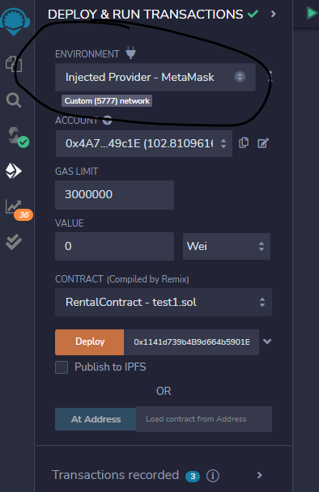
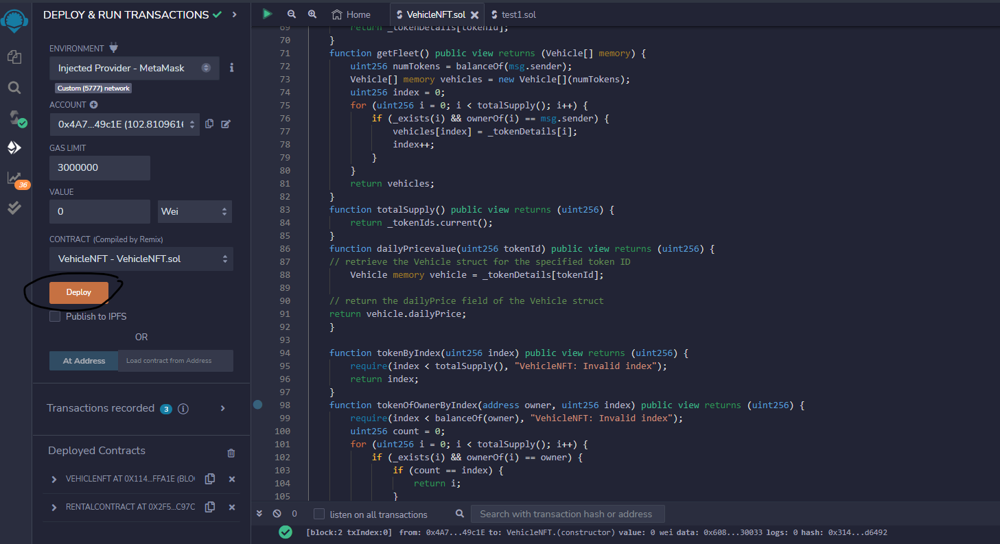
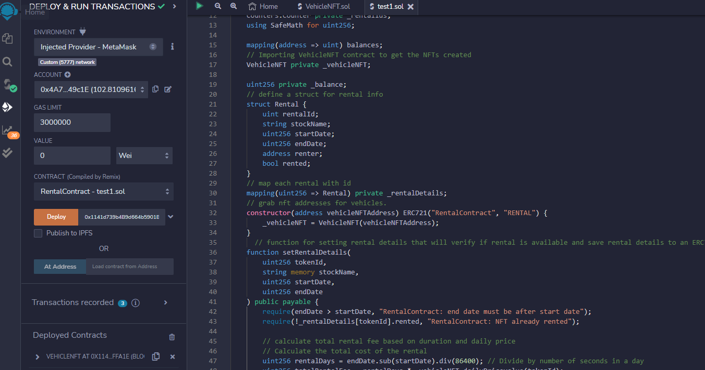
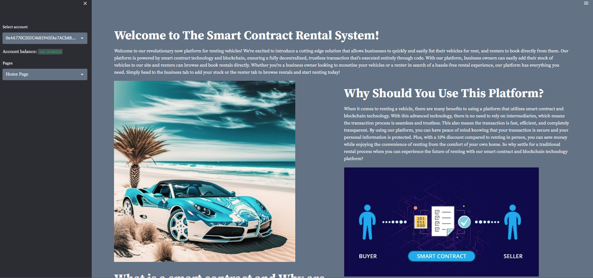

# Smart-Contract-Rental-System
**Project 3 for Fintech bootcamp through UC Berkeley.**

# Project Description
We created a project that is a rental platform that utilizes blockchain technology and smart contracts to enable business owners to offer their vehicles for rent to interested parties. By minting vehicles onto the blockchain, the platform eliminates the need for intermediaries to control transactions, ensuring security and transparency. The smart contracts automatically enforce the rules and regulations specified within the contract, ensuring that transactions are completed according to agreed-upon terms. As a decentralized and immutable ledger, the blockchain provides a secure and transparent storage system for data, further enhancing the platform's security and trustworthiness. This system differs from traditional rental platforms as it eliminates the need for third-party involvement, making the rental process more efficient, transparent, and secure. 

All user data, including rental information, is stored securely in an AWS S3, ensuring the platform's privacy and security. The platform utilizes two smart contracts to facilitate the rental process. The first contract is the rental contract, which links to the vehicle contract to access available vehicles and allows users to set rental details. The rental contract also includes a function for returning rental payments in the event of a cancellation.
The second contract is the vehicle NFT contract, which stores vehicle details on-chain, such as the rental price and a digital representation of the rental fleet. By utilizing NFTs, the platform ensures the uniqueness and authenticity of each vehicle rental, enhancing the overall transparency and trustworthiness of the platform.

In addition to the rental platform's innovative use of blockchain technology and smart contracts, the website offers an intuitive interface that allows users to interact easily with the contracts. Through the streamlit interface, users can mint vehicles onto the blockchain, view available vehicles, and browse rental rates. The website also features an analysis section incorporating a machine-learning model that uses past performance to forecast possible scenarios.

Feel free to contact the developers on the Home Page and give us your feedback for things to improve in the future, 

Mahalo!

## Package Requirements and versions
First before installing any packages and getting setup make sure you are in a `dev` environment or an environment you are comfortable downloading packages into. If you don't know what a `dev` environment is follow along below. 
To get your `dev` environment setup do the following in your command line:

- Creating a dev environment for python 3.7 called 'dev' - if you do not already have an environment setup 
    - Get setup in your preferred CLI (Gitbash, terminal, etc)
    - `conda create -n dev python=3.7 anaconda`
    - Once you have created the environment, type the following to activate and deactivate.
    ### To activate: `conda activate dev`
    ### To deactivate: `conda deactivate dev`

Once you have cloned the repo and have a `dev` or similar env with python 3.7 or higher the next step is to make sure you have the packages installed locally. Navigate to the newly cloned repo and make sure you are in the right directory. 
Then type `pip install requirements.txt`, this will install any necessary packages to your env. 

*NOTE if you get errors installing requirements use conda install -c conda-forge `package name`"*

## File Navigation
- `main.py` -- File used for deploying code to streamlit website
- `Rental_system` -- The folder contains our smart contracts that were created through Solidity and is connected with `Ganache` with `MetaMask` to deploy the smart contracts. This folder also contains the ABIs for the contracts, if any changes are made to the .sol files these ABIs need to be updated.
- `Resources` -- csv files for rental analysis

## Usage Streamlit Dashboard
First, before getting streamlit ready, make sure you have your contracts and local Ganache environment setup and connected to your metamask. You can follow the instructions [here](https://www.geeksforgeeks.org/how-to-set-up-ganche-with-metamask/) if you need help, but basically just need to import the ganache private keys and add the RPC for the ganache network. Once you have connected ganache to metamask, go to [remix](https://remix.ethereum.org/) and make sure to change the environment variable to 'injected provider' like the following photo shows.

You will then need to compile and deploy the vehicle NFT contract like the next photo shows,

Next, get the rental contract deployed and point it to the vehicle NFT contract with the address of the newly created vehicle contract.

Once you have both contracts deployed, update the .env file with your newly deployed contract addresses, and you will also need to add the information for your AWS account to connect to the s3 buckets for data storage.
Once all that is done, then to get streamlit running locally and start browsing the site, start by making sure your `dev` env is running and has the `requirements.txt` installed. Inside your preferred CLI make sure you in the right directory with the `main.py` file, and then type the following command - ` streamlit run main.py` -. You should see the terminal run some code and a website with a local host IP address will pop up on your browser looking something like this - 

If you have any questions or feedback please reach out to us via the email box on the homepage or on linkedin below. Thanks for reading and hope you enjoy the app! 

## Contributors
[Robin Thorsen](https://www.linkedin.com/in/robin-thorsen-079819120/), [Kaio Farkouh](https://www.linkedin.com/in/kaio-farkouh/), [Zach Eras](https://www.linkedin.com/in/zachary-eras-24b5a8149/) are the developers/analysts who worked on this project.
